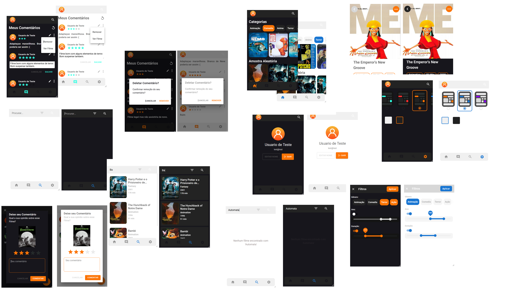
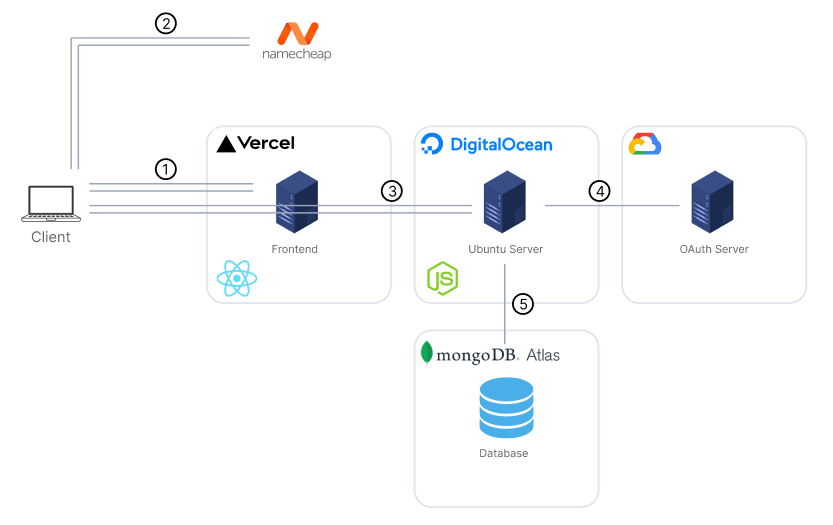

<h1>WebApp MERN FullStack de Filmes</h1>

<h2>Resumo</h2>

Usuários devem fazer login (Google Oauth ou test@test test123, compartilhada) para interagirem com quaisquer conteudos.
.

 

<h2><b>Nota: Apenas a UI de dimensões Mobile está Completa (apesar de todas funcionarem), portanto acessar 
(<a href='https://procurarfilmes.vercel.app/login'>https://procurarfilmes.vercel.app/login</a>) em Mobile ou com restrições de tamanho no browser terá melhor aproveitamento do Design por enquanto.</b></h2>
 

<h1>Features</h1>

- fazer Login (Google Oauth ou test@test test123, compartilhada).
- visuailizar filmes.
- criar Comentar (C).
- ler Comentarios (R).
- editar (U).
- deletar comentarios (D).
- ver e editar nome de perfil.
- ver perfil de outro usuario a partir de um comentario.
- pesquisar filmes.
- filtrar filmes por atributos.
- mudar tema.
 

<h1>Desafios</h1>

- VULTr (Plataforma de VPS) fornece apenas IPv6 para a maquina virtual o que causou erros no momento em que o servidor se conecta com o MongoDB atlas (que expoe IPv4 apenas) o que me levou a optar pela digital ocean.  
 

<h1>Arquitetura do Código</h1>

Backend foi feito em camadas (Controller, Repository, Services & DTOs) inspirado no Framework NestJs que adiciona niveis de complexidade mas permite a facil implementação de novas features. (Compensativo).

<h1>Arquitetura Geral</h1>

- 1- Requere arquivo html,js,css.
- 2- Requete IPv4 do servidor.
- 3- Frontend acessa servidor.
- 4- Fluxo de autenticação.
- 5- Cliente acessa conteudo. 

<h1>Ferramentas</h1>
<h2>Frontend</h2>

- ReactJs (com javascript)
- MaterialUI

<h2>Backend</h2>

- Typescript
- NodeJs
- Express

<h2>Banco de Dados</h2>

- MongoDB (Atlas)

<h1>Hospedagem</h1>
 
 - Frontend: Build e Deploy feito na Vercel.
 - Backend: Build e Bundle feito localmente (./backend_builder) e Deploy feito na DigitalOcean via SCP e SSH.
 - Auth: Google oAuth server. 
 - Banco de Dados: MongoDB Atlas (Online Free Tier).
 - Dominio: Namecheap.
 - SSL configurado manualmente com Let's encrypt.

<h1>Build</h1>
 
- npm run build (./backend)
- npm run run (./backend_builder)
- scp -i '[ssh priv key path]'  '.\backend_builder\bundle\main.js' [usuario]@[IPv4]:/[usuario]/app
- ssh -i '[ssh priv key path]' [usuario]@[IPv4]

<h1>Melhorias Futuras</h1>

- Implementar design para outras dimensões
- Implementar Cache com Redis (Alpine) e Docker. Atualmente, apenas o cliente lida com cache. ('Cache-Control' header).
- Implementar Redux ou outra solução de refatoração para manter o estado (Próximo Projeto).